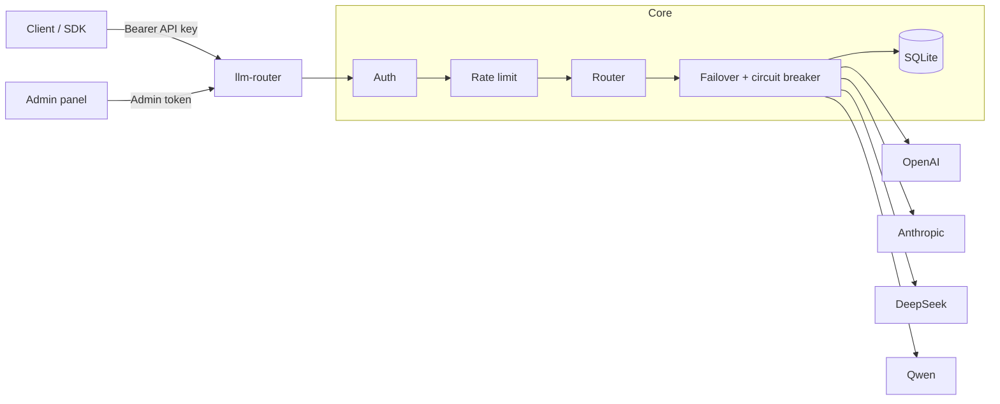

# llm-router

OpenAI-compatible LLM gateway built with FastAPI and asyncio.

Point your apps at a single `/v1/chat/completions` endpoint. The gateway routes traffic across providers (OpenAI, Anthropic, DeepSeek, Qwen), fails over when an upstream is unhealthy, and keeps a simple usage/cost ledger in SQLite.

Inspired by projects like one-api / new-api, rewritten around asyncio + `httpx.AsyncClient`.

## Features

- OpenAI-compatible chat completions (JSON and SSE)
- Multi-provider adapters: OpenAI, Anthropic (Claude), DeepSeek, Qwen
- Routing by API key and model prefix
- Failover with timeout budget and circuit breaker
- Per-key token-bucket rate limiting
- SQLite usage / estimated cost tracking
- Minimal admin panel at `/panel/`
- `/health` and optional Prometheus `/metrics`
- Docker Compose one-command run

## Quick start

### Docker

```bash
git clone https://github.com/shu0819-sjy/llm-router.git
cd llm-router
cp .env.example .env   # then set LLM_ROUTER_ADMIN_TOKEN and upstream keys
docker compose up --build -d
```

When the container is up, check health and open the admin UI on the host:

- Health: `GET /health` on port `8000`
- Panel: `/panel/`

Example:

```bash
curl http://localhost:8000/health
```

### Development

```bash
python -m venv .venv
source .venv/bin/activate   # Windows: .venv\Scripts\activate
pip install -r requirements.txt -r requirements-dev.txt
cp .env.example .env
uvicorn app.main:app --reload --host 0.0.0.0 --port 8000
```

### Example request

```bash
curl http://localhost:8000/v1/chat/completions \
  -H "Authorization: Bearer sk-demo-key" \
  -H "Content-Type: application/json" \
  -d '{"model":"deepseek-chat","messages":[{"role":"user","content":"hi"}]}'
```

Demo keys come from `LLM_ROUTER_API_KEYS` in `.env`. Keys created in the panel are stored as hashes in SQLite and survive restarts.

## Architecture



Non-streaming path: authenticate → rate-limit → pick candidates → try providers within the failover budget → record usage → return an OpenAI-shaped response.

Streaming path: same until the first SSE byte. After that, the stream stays on the chosen upstream; disconnect cancels the upstream request.

## Configuration

See [`.env.example`](./.env.example). Common settings:

| Variable | Default | Meaning |
|----------|---------|---------|
| `LLM_ROUTER_PORT` | `8000` | Listen port |
| `LLM_ROUTER_DB_PATH` | `./data/llm_router.db` | SQLite path |
| `LLM_ROUTER_ADMIN_TOKEN` | — | Required for panel write APIs |
| `LLM_ROUTER_DEFAULT_TIMEOUT_MS` | `500` | Per-attempt upstream timeout |
| `LLM_ROUTER_FAILOVER_BUDGET_MS` | `500` | Total failover budget |
| `LLM_ROUTER_CB_FAILURE_THRESHOLD` | `3` | Failures before opening a circuit |
| `LLM_ROUTER_CB_RECOVERY_TIMEOUT_S` | `30` | Open → half-open wait |
| `LLM_ROUTER_RATE_CAPACITY` | `60` | Token-bucket capacity |
| `LLM_ROUTER_RATE_REFILL_PER_S` | `1.0` | Refill rate |
| `LLM_ROUTER_ENABLE_PROMETHEUS` | `false` | Expose `/metrics` |
| `LLM_ROUTER_PROVIDER_ORDER` | `deepseek,openai,anthropic,qwen` | Failover order |
| `LLM_ROUTER_API_KEYS` | `name:key[:provider]` | Bootstrap gateway keys |
| `OPENAI_API_KEY` / `ANTHROPIC_API_KEY` / `DEEPSEEK_API_KEY` / `QWEN_API_KEY` | | Upstream credentials |

Do not commit `.env`.

## API

| Method | Path | Auth | Notes |
|--------|------|------|-------|
| `POST` | `/v1/chat/completions` | API key | JSON or SSE (`stream=true`) |
| `GET` | `/health` | none | Liveness / provider / DB status |
| `GET` | `/metrics` | none | Prometheus (optional) |
| `GET` | `/panel/` | — | Admin UI |
| `*` | `/panel/api/*` | Admin token | Keys, providers, usage |

## Tests

```bash
pytest --cov=app --cov-report=term-missing
python scripts/bench_failover.py
```

v0.1 ships with a full unit suite (coverage target ≥80% on `app/`) and an in-process failover micro-benchmark that uses fake upstreams only.

## Project layout

```text
app/                 gateway code
tests/               pytest
scripts/             benchmarks
Dockerfile
docker-compose.yml
.env.example
```

## Limitations (v0.1)

- Rate limiter and circuit breakers are in-memory (not shared across replicas)
- No billing product / multi-tenant RBAC beyond API keys
- Chat completions only (no embeddings / images / audio routes)
- Streamed responses currently record token counts as 0

## License

MIT — see [LICENSE](./LICENSE).
