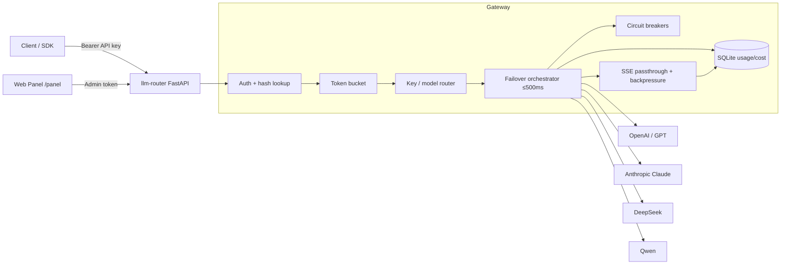

# llm-router

**OpenAI-compatible asyncio FastAPI LLM gateway** (one-api / new-api style) with multi-provider routing, key-based routing, **&lt;500 ms failover**, token-bucket rate limiting, SQLite token/cost tracking, SSE streaming, `/health`, a minimal Web panel, and one-click Docker.

| | |
|---|---|
| Version | **0.1.0** |
| Python | ≥ 3.11 |
| License | MIT |
| Workspace | `D:\deepseek workspace\llm-router` (never `C:\`) |
| Spec | [`REQUIREMENTS.md`](./REQUIREMENTS.md) |

---

## Features

- **OpenAI-compatible** `POST /v1/chat/completions` (JSON + `stream=true` SSE)
- **4 upstream providers:** OpenAI (GPT), Anthropic (Claude adapter), DeepSeek, Qwen
- **Key-based + model-prefix routing** with ordered failover candidates
- **Budgeted failover** (`LLM_ROUTER_FAILOVER_BUDGET_MS=500`) + **circuit breaker** (closed → open → half-open)
- **Token-bucket** rate limit per API key (`429` + `Retry-After`)
- **SQLite ledger:** `api_keys`, `providers`, `usage_events`, `model_prices` (cost USD)
- **SSE passthrough** with pre-first-byte failover and async **backpressure** / client-disconnect cancel
- **`GET /health`** (providers + circuits + db) and optional **`GET /metrics`** (Prometheus)
- **Web panel** at `/panel/` — keys CRUD, providers/circuits, usage/cost (admin token)
- **Docker** one-command + Compose healthcheck
- **pytest** suite with **≥80%** line coverage (measured **~94%** on `app/`)

---

## Architecture



**Request path (non-stream):** authenticate (env hot path → SHA-256 `api_keys.key_hash`) → rate limit → resolve candidates → try providers under failover budget → record usage/cost → return OpenAI-shaped JSON.

**Stream path:** same until first SSE byte; after first byte, no mid-stream provider hop; chunks yielded with backpressure; disconnect cancels upstream.

---

## Quick start

### One-click Docker

```powershell
cd "D:\deepseek workspace\llm-router"
copy .env.example .env
# Edit .env: set LLM_ROUTER_ADMIN_TOKEN and upstream API keys you need
docker compose up --build -d
curl http://127.0.0.1:8000/health
```

Panel: [http://127.0.0.1:8000/panel/](http://127.0.0.1:8000/panel/)

### Local dev

```powershell
cd "D:\deepseek workspace\llm-router"
python -m venv .venv
.\.venv\Scripts\Activate.ps1
pip install -r requirements.txt -r requirements-dev.txt
copy .env.example .env
uvicorn app.main:app --reload --host 0.0.0.0 --port 8000
```

### Chat example

```powershell
curl http://127.0.0.1:8000/v1/chat/completions `
  -H "Authorization: Bearer sk-demo-key" `
  -H "Content-Type: application/json" `
  -d '{"model":"deepseek-chat","messages":[{"role":"user","content":"hi"}]}'
```

Demo keys come from `LLM_ROUTER_API_KEYS` in `.env` (see `.env.example`). Panel-created keys survive restart via hash lookup in SQLite.

---

## Configuration

All knobs are environment variables (see [`.env.example`](./.env.example)). Highlights:

| Variable | Default | Meaning |
|----------|---------|---------|
| `LLM_ROUTER_PORT` | `8000` | Listen port |
| `LLM_ROUTER_DB_PATH` | `./data/llm_router.db` | SQLite file |
| `LLM_ROUTER_ADMIN_TOKEN` | *(set me)* | Panel mutating APIs |
| `LLM_ROUTER_DEFAULT_TIMEOUT_MS` | `500` | Per-attempt upstream timeout |
| `LLM_ROUTER_FAILOVER_BUDGET_MS` | `500` | Total failover wall budget |
| `LLM_ROUTER_CB_FAILURE_THRESHOLD` | `3` | Failures to open circuit |
| `LLM_ROUTER_CB_RECOVERY_TIMEOUT_S` | `30` | Open → half-open |
| `LLM_ROUTER_RATE_CAPACITY` | `60` | Token-bucket capacity |
| `LLM_ROUTER_RATE_REFILL_PER_S` | `1.0` | Refill rate |
| `LLM_ROUTER_ENABLE_PROMETHEUS` | `false` | Expose `/metrics` |
| `LLM_ROUTER_PROVIDER_ORDER` | `deepseek,openai,anthropic,qwen` | Failover order |
| `LLM_ROUTER_API_KEYS` | `name:key[:provider]` CSV | Bootstrap API keys |
| `OPENAI_API_KEY` / `ANTHROPIC_API_KEY` / `DEEPSEEK_API_KEY` / `QWEN_API_KEY` | | Upstream credentials |

**Never commit `.env`.** Only `.env.example` is tracked.

---

## Benchmark (failover)

Script: [`scripts/bench_failover.py`](./scripts/bench_failover.py) (in-process fakes, **no live paid APIs**).

Representative run (20 rounds, primary delay 80 ms, secondary 20 ms, budget 500 ms):

| Metric | Result |
|--------|--------|
| mean | **~124 ms** |
| p50 | **~124 ms** |
| p95 | **~127 ms** |
| max | **~127 ms** |
| budget | **PASS** (max &lt; 500 ms) |

```powershell
python scripts/bench_failover.py
```

QA verification also recorded max **125.10 ms** under the same budget.

---

## Tests & coverage

```powershell
pytest --cov=app --cov-report=term-missing
```

- **48** tests green (v0.1 freeze)
- Line coverage on `app/` ≈ **94%** (bar: **≥ 80%**)

---

## API surface (summary)

| Method | Path | Auth | Notes |
|--------|------|------|-------|
| `POST` | `/v1/chat/completions` | API key | Sync or SSE (`stream`) |
| `GET` | `/health` | none | status, providers, circuits, db |
| `GET` | `/metrics` | none | Prometheus when enabled |
| `GET` | `/panel/` | — | Static admin UI |
| `*` | `/panel/api/keys\|providers\|usage` | Admin token | MVP admin JSON |

Full contracts: [`REQUIREMENTS.md`](./REQUIREMENTS.md) §9.

---

## Interview talking points

1. **Why FastAPI + asyncio** — concurrent SSE streams, typed Pydantic validation, small operational surface.
2. **Failover SLO** — budgeted wall clock (not infinite retries); per-attempt timeout shrinks with remaining budget; circuit breaker stops retry storms; half-open probes recovery.
3. **Token bucket vs fixed window** — smooth refill, controlled burst (`capacity`), per-key overrides from SQLite; returns `Retry-After`.
4. **Cost ledger** — hash-only API keys at rest; `usage_events` + `model_prices` → `cost_usd` without building a billing product.
5. **SSE backpressure** — async generators / `StreamingResponse`; await each send; cancel on client disconnect; **no mid-stream failover** after first byte (predictable client behavior).
6. **Provider Protocol** — OpenAI-compat passthrough (GPT/DeepSeek/Qwen) vs Anthropic Messages ↔ OpenAI shape adapter.
7. **Ops MVP** — `/health` for Compose healthcheck, optional Prometheus, non-root Docker user.
8. **Honest trade-offs** — in-memory rate limit + breakers (multi-replica → Redis later); no full RBAC / billing UI (see non-goals).

---

## Project layout

```text
app/           FastAPI app, providers, failover, ratelimit, streaming, db, panel
tests/         pytest suite
scripts/       bench_failover.py
Dockerfile     python:3.11-slim + healthcheck
docker-compose.yml
REQUIREMENTS.md
RELEASE_NOTES_v0.1.md
```

---

## GitHub publish

Target remote: `https://github.com/shu0819-sjy/llm-router.git`

If `gh` reports an invalid token for `shu0819-sjy`:

```powershell
gh auth login -h github.com
# follow prompts (HTTPS + browser or token)
gh auth status
cd "D:\deepseek workspace\llm-router"
gh repo create shu0819-sjy/llm-router --public --source=. --remote=origin --push
git tag v0.1.0
git push origin v0.1.0
gh release create v0.1.0 -F RELEASE_NOTES_v0.1.md
```

---

## Non-goals (v0.1)

- No billing / invoice UI  
- No multi-tenant RBAC beyond API keys  
- No artifacts under `C:\` — everything lives under `D:\deepseek workspace\llm-router`  
- Chat completions only (no embeddings / images / audio)

---

## License

MIT — see [`LICENSE`](./LICENSE).
