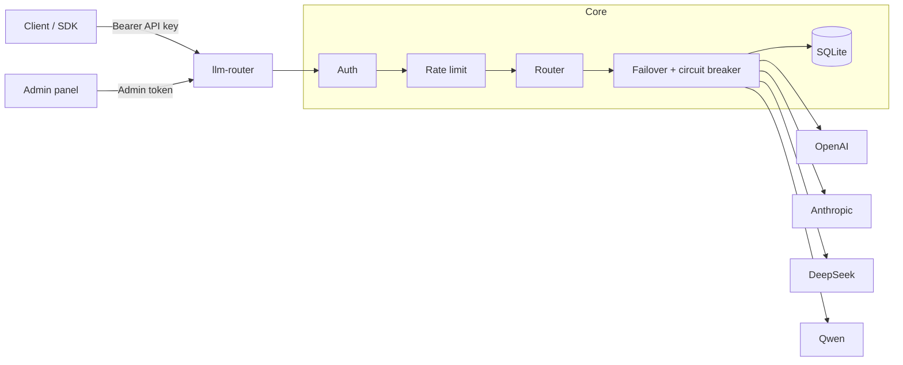

# llm-router

OpenAI-compatible LLM gateway built with FastAPI and asyncio.

Point your apps at a single `/v1/chat/completions` endpoint. The gateway routes traffic across providers (OpenAI, Anthropic, DeepSeek, Qwen), fails over when an upstream is unhealthy, and keeps a simple usage/cost ledger in SQLite.

Inspired by projects like one-api / new-api, rewritten around asyncio + `httpx.AsyncClient`.

[](https://github.com/shu0819-sjy/llm-router/actions/workflows/ci.yml)

## Features

- OpenAI-compatible chat completions (JSON and SSE)
- Multi-provider adapters: OpenAI, Anthropic (Claude), DeepSeek, Qwen
- Routing by API key and model prefix
- Failover with timeout budget and circuit breaker
- Per-key token-bucket rate limiting
- SQLite usage / cost tracking with price-version snapshots
- Minimal admin panel at `/panel/`
- Split health endpoints plus legacy `/health`, optional Prometheus `/metrics`
- Docker Compose one-command run
- GitHub Actions CI (see [`.github/workflows/ci.yml`](./.github/workflows/ci.yml))

## Quick start

### Docker

```bash
git clone https://github.com/shu0819-sjy/llm-router.git
cd llm-router
cp .env.example .env
# Set a strong unique LLM_ROUTER_ADMIN_TOKEN (required outside development).
# For a quick local compose smoke you may set LLM_ROUTER_ENV=development instead.
docker compose up --build -d
```

When the container is up:

- Legacy health: `GET /health` on port `8000`
- Liveness: `GET /health/live`
- Readiness: `GET /health/ready`
- Panel: `/panel/`

```bash
curl -fsS http://localhost:8000/health
curl -fsS http://localhost:8000/health/ready
```

### Development

```bash
python -m venv .venv
source .venv/bin/activate   # Windows: .venv\Scripts\activate
pip install -r requirements.txt -r requirements-dev.txt
cp .env.example .env
```

Before starting uvicorn, either:

1. set `LLM_ROUTER_ENV=development` in `.env` (allows the placeholder admin token from `.env.example`), **or**
2. set a strong unique `LLM_ROUTER_ADMIN_TOKEN` and leave `LLM_ROUTER_ENV` at the default (`production`).

Outside development/test, a strong unique `LLM_ROUTER_ADMIN_TOKEN` is **mandatory** — empty or well-known placeholders are rejected at startup.

```bash
uvicorn app.main:app --reload --host 0.0.0.0 --port 8000
```

### Example request

```bash
curl http://localhost:8000/v1/chat/completions \
  -H "Authorization: Bearer sk-demo-key" \
  -H "Content-Type: application/json" \
  -d '{"model":"deepseek-chat","messages":[{"role":"user","content":"hi"}]}'
```

Demo keys come from `LLM_ROUTER_API_KEYS` in `.env`. Keys created in the panel are stored as hashes in SQLite and survive restarts.

## Architecture



Non-streaming path: authenticate → rate-limit → pick candidates → try providers within the failover budget → record usage → return an OpenAI-shaped response.

Streaming path: same until the first valid SSE `data:` byte. After that, the stream stays on the chosen upstream; disconnect cancels the upstream request. Usage is recorded when the upstream SSE emits a usage-bearing chunk; otherwise the ledger row is marked `accounting_status=unavailable` and cost is not invented.

## Configuration

See [`.env.example`](./.env.example). Common settings:

| Variable | Default | Meaning |
|----------|---------|---------|
| `LLM_ROUTER_ENV` | `production` | Runtime mode: `production` (default), `development`, or `test`. Outside development/test, insecure admin tokens are rejected. |
| `LLM_ROUTER_PORT` | `8000` | Listen port |
| `LLM_ROUTER_DB_PATH` | `./data/llm_router.db` | SQLite path |
| `LLM_ROUTER_ADMIN_TOKEN` | — | **Required** for panel APIs. Must be a strong unique value outside development. |
| `LLM_ROUTER_RATE_LIMIT_SECRET` | — | Optional HMAC secret for rate-limit bucket digests. If unset, a process-local secret is derived; set explicitly in multi-instance deployments. |
| `LLM_ROUTER_DEFAULT_TIMEOUT_MS` | `500` | Per-attempt upstream timeout |
| `LLM_ROUTER_FAILOVER_BUDGET_MS` | `500` | Total failover budget |
| `LLM_ROUTER_CB_FAILURE_THRESHOLD` | `3` | Failures before opening a circuit |
| `LLM_ROUTER_CB_RECOVERY_TIMEOUT_S` | `30` | Open → half-open wait |
| `LLM_ROUTER_RATE_CAPACITY` | `60` | Token-bucket capacity |
| `LLM_ROUTER_RATE_REFILL_PER_S` | `1.0` | Refill rate |
| `LLM_ROUTER_ENABLE_PROMETHEUS` | `false` | Expose `/metrics` |
| `LLM_ROUTER_PROVIDER_ORDER` | `deepseek,openai,anthropic,qwen` | Failover order |
| `LLM_ROUTER_API_KEYS` | `name:key[:provider]` | Bootstrap gateway keys |
| `OPENAI_API_KEY` / `ANTHROPIC_API_KEY` / `DEEPSEEK_API_KEY` / `QWEN_API_KEY` | | Upstream credentials |

Do not commit `.env`.

## API

| Method | Path | Auth | Notes |
|--------|------|------|-------|
| `POST` | `/v1/chat/completions` | API key | JSON or SSE (`stream=true`) |
| `GET` | `/v1/models` | API key | OpenAI-compatible model list |
| `GET` | `/health` | none | Legacy aggregate status (`status`, `version`, `uptime_s`, `providers`, `db`) |
| `GET` | `/health/live` | none | Process liveness (no dependency checks) |
| `GET` | `/health/ready` | none | Readiness (fails when DB is not ready) |
| `GET` | `/health/providers` | none | Per-provider enabled/circuit detail |
| `GET` | `/metrics` | none | Prometheus (optional) |
| `GET` | `/panel/` | — | Admin UI |
| `*` | `/panel/api/*` | Admin token | Keys, providers, usage |

## Tests

Default runs execute **unit tests only** (no live upstream network):

```bash
pytest --cov=app --cov-report=term-missing
ruff check app tests scripts
python scripts/bench_failover.py
```

v0.2.0 ships with a full unit suite (coverage target ≥80% on `app/`) and an in-process failover micro-benchmark that uses fake upstreams only.

### Opt-in live provider integration tests

Integration tests under `tests/integration/` are never selected by default (`-m "not integration"`). They also require:

```bash
export LLM_ROUTER_RUN_INTEGRATION=1   # Windows PowerShell: $env:LLM_ROUTER_RUN_INTEGRATION=1
python -m pytest -m integration -q
```

Do not set `LLM_ROUTER_RUN_INTEGRATION=1` in default CI.

CI workflow: [`.github/workflows/ci.yml`](./.github/workflows/ci.yml) (Python 3.11/3.12, ruff, informational mypy, pytest coverage gate, Docker build + `/health` smoke).

## Project layout

```text
app/                 gateway code
tests/               pytest (unit + opt-in integration/)
scripts/             benchmarks, client examples, release audit
Dockerfile
docker-compose.yml
.env.example
```

## Limitations (v0.2.0)

- Rate limiter and circuit breakers are in-memory (not shared across replicas)
- No billing product / multi-tenant RBAC beyond API keys
- Chat completions only (no embeddings / images / audio routes)
- Streaming usage: when the upstream SSE includes a usage-bearing chunk, tokens are recorded as `accounting_status=actual`. If usage cannot be observed, the ledger row is marked `accounting_status=unavailable` and cost is not invented (no synthetic token counts).

## Contributing / Security

- Contributing guide: [CONTRIBUTING.md](./CONTRIBUTING.md)
- Vulnerability reporting: [SECURITY.md](./SECURITY.md)

## License

MIT — see [LICENSE](./LICENSE).
