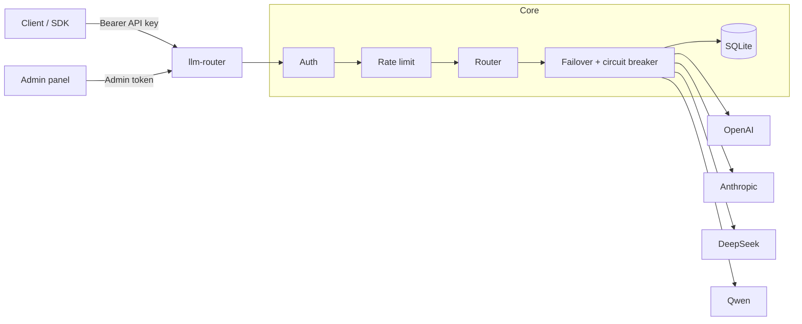

# llm-router

LLM gateway with **OpenAI-compatible Chat Completions and Models APIs**, built with FastAPI and asyncio.

Point your apps at a single `/v1/chat/completions` endpoint. The gateway routes traffic across providers (OpenAI, Anthropic, DeepSeek, Qwen), fails over when an upstream is unhealthy, and keeps a simple usage/cost ledger in SQLite. OpenAI API compatibility is limited to the endpoints listed under [Compatibility scope](#compatibility-scope) — llm-router is not a drop-in replacement for the full OpenAI API.

Inspired by projects like one-api / new-api, rewritten around asyncio + `httpx.AsyncClient`.

[](https://github.com/shu0819-sjy/llm-router/actions/workflows/ci.yml)

## Features

- OpenAI-compatible Chat Completions (JSON and SSE) and Models list — the full extent of OpenAI API compatibility (see below)
- Multi-provider adapters: OpenAI, Anthropic (Claude), DeepSeek, Qwen
- Routing by API key and model prefix
- Failover with timeout budget and circuit breaker
- Tool-call fallback: capability-filtered routing for `tools` / `tool_choice` requests, with structured errors when no tool-capable provider remains
- Per-key token-bucket rate limiting
- SQLite usage / cost tracking with price-version snapshots
- Minimal admin panel at `/panel/`
- Split health endpoints plus legacy `/health`, optional Prometheus `/metrics`
- Docker Compose one-command run
- GitHub Actions CI (see [`.github/workflows/ci.yml`](./.github/workflows/ci.yml))

## Compatibility scope

llm-router is **OpenAI-compatible for exactly the following API surface, and nothing more**:

| Supported | Notes |
|-----------|-------|
| `POST /v1/chat/completions` (JSON) | Request/response follows the OpenAI Chat Completions shape |
| `POST /v1/chat/completions` (SSE) | `stream: true` returns `text/event-stream` chunks |
| `GET /v1/models` | OpenAI-shaped model list (from the price catalog) |

**Explicitly not supported** (requests to these paths are not implemented — do not expect OpenAI SDK methods for them to work):

- `POST /v1/completions` (legacy completions)
- `/v1/embeddings`, `/v1/images`, `/v1/audio/*`, `/v1/files`, `/v1/batches`, `/v1/fine_tuning/*`
- OpenAI organization/project header semantics, batch/webhook delivery

**Provider capability caveats:**

- `tools`, `tool_choice`, and `response_format` are forwarded as-is to OpenAI-compatible upstreams (OpenAI, DeepSeek, Qwen); whether they take effect depends on that upstream.
- Tool-call fallback: requests that carry `tools` or `tool_choice` are routed only to providers that support tool calling; when the preferred candidate cannot serve them, failover continues to the next tool-capable provider within the same timeout budget, and if none remains the gateway returns a structured error that names the unsupported field instead of silently dropping it.
- Anthropic-routed requests carrying `tools` / `tool_choice` / `response_format` are not mapped by the Anthropic adapter; such requests fail over to a tool-capable provider under the rule above rather than reaching Anthropic.
- Undocumented request fields are passed through where possible, but byte-identical upstream passthrough is not guaranteed.

## Quick start

### Docker

```bash
git clone https://github.com/shu0819-sjy/llm-router.git
cd llm-router
cp .env.example .env
# Set a strong unique LLM_ROUTER_ADMIN_TOKEN (required outside development).
# For a quick local compose smoke you may set LLM_ROUTER_ENV=development instead.
docker compose up --build -d
```

When the container is up:

- Legacy health: `GET /health` on port `8000`
- Liveness: `GET /health/live`
- Readiness: `GET /health/ready`
- Panel: `/panel/`

```bash
curl -fsS http://localhost:8000/health
curl -fsS http://localhost:8000/health/ready
```

### Development

```bash
python -m venv .venv
source .venv/bin/activate   # Windows: .venv\Scripts\activate
pip install -r requirements.txt -r requirements-dev.txt
cp .env.example .env
```

Before starting uvicorn, either:

1. set `LLM_ROUTER_ENV=development` in `.env` (allows the placeholder admin token from `.env.example`), **or**
2. set a strong unique `LLM_ROUTER_ADMIN_TOKEN` and leave `LLM_ROUTER_ENV` at the default (`production`).

Outside development/test, a strong unique `LLM_ROUTER_ADMIN_TOKEN` is **mandatory** — empty or well-known placeholders are rejected at startup.

```bash
uvicorn app.main:app --reload --host 0.0.0.0 --port 8000
```

### Example request

```bash
curl http://localhost:8000/v1/chat/completions \
  -H "Authorization: Bearer sk-demo-key" \
  -H "Content-Type: application/json" \
  -d '{"model":"deepseek-chat","messages":[{"role":"user","content":"hi"}]}'
```

Demo keys come from `LLM_ROUTER_API_KEYS` in `.env`. Keys created in the panel are stored as hashes in SQLite and survive restarts.

## Architecture



Non-streaming path: authenticate → rate-limit → pick candidates → try providers within the failover budget → record usage → return an OpenAI-shaped response.

Streaming path: same until the first valid SSE `data:` byte. After that, the stream stays on the chosen upstream; disconnect cancels the upstream request. Usage is recorded when the upstream SSE emits a usage-bearing chunk; otherwise the ledger row is marked `accounting_status=unavailable` and cost is not invented.

## Configuration

See [`.env.example`](./.env.example). Common settings:

| Variable | Default | Meaning |
|----------|---------|---------|
| `LLM_ROUTER_ENV` | `production` | Runtime mode: `production` (default), `development`, or `test`. Outside development/test, insecure admin tokens are rejected. |
| `LLM_ROUTER_PORT` | `8000` | Listen port |
| `LLM_ROUTER_DB_PATH` | `./data/llm_router.db` | SQLite path |
| `LLM_ROUTER_ADMIN_TOKEN` | — | **Required** for panel APIs. Outside development: ≥ `ADMIN_TOKEN_MIN_LENGTH`, mixed character classes, not a placeholder. |
| `LLM_ROUTER_ADMIN_TOKEN_MIN_LENGTH` | `24` | Production admin-token length floor. |
| `LLM_ROUTER_RATE_LIMIT_SECRET` | — | Optional HMAC secret for rate-limit bucket digests. If unset, a process-local secret is derived; set explicitly in multi-instance deployments. |
| `LLM_ROUTER_MAX_BODY_BYTES` | `2097152` | Max request body size (413 `request_too_large`). |
| `LLM_ROUTER_MAX_MESSAGES` / `MAX_TOOLS` | `512` / `64` | Chat schema bounds (400). |
| `LLM_ROUTER_MAX_CONCURRENT_CHAT_REQUESTS` | `64` | In-flight `/v1/chat/*` cap (429). |
| `LLM_ROUTER_DIAGNOSTICS_AUTH` | `auto` | Auth for `/health/providers` + `/metrics`: `auto` (admin outside development), `admin`, or `public`. |
| `LLM_ROUTER_ALLOW_PRIVATE_PROVIDER_URLS` | `false` | Dev-only SSRF override for loopback/private provider base URLs. |
| `LLM_ROUTER_DEFAULT_TIMEOUT_MS` | `30000` | Per-attempt upstream timeout (ms); sized for real LLM calls |
| `LLM_ROUTER_FAILOVER_BUDGET_MS` | `60000` | Total failover budget (ms) across candidates |
| `LLM_ROUTER_CB_FAILURE_THRESHOLD` | `3` | Failures before opening a circuit |
| `LLM_ROUTER_CB_RECOVERY_TIMEOUT_S` | `30` | Open → half-open wait |
| `LLM_ROUTER_RATE_CAPACITY` | `60` | Token-bucket capacity |
| `LLM_ROUTER_RATE_REFILL_PER_S` | `1.0` | Refill rate |
| `LLM_ROUTER_ENABLE_PROMETHEUS` | `false` | Expose `/metrics` (still subject to diagnostics auth) |
| `LLM_ROUTER_PROVIDER_ORDER` | `deepseek,openai,anthropic,qwen` | Failover order among prefix-compatible providers |
| `LLM_ROUTER_API_KEYS` | `name:key[:provider]` | Bootstrap gateway keys |
| `OPENAI_API_KEY` / `ANTHROPIC_API_KEY` / `DEEPSEEK_API_KEY` / `QWEN_API_KEY` | | Upstream credentials |

Do not commit `.env`.

## API

| Method | Path | Auth | Notes |
|--------|------|------|-------|
| `POST` | `/v1/chat/completions` | API key | JSON or SSE (`stream=true`) |
| `GET` | `/v1/models` | API key | OpenAI-compatible model list |
| `GET` | `/health` | none | Legacy aggregate status (`status`, `version`, `uptime_s`, `providers`, `db`) |
| `GET` | `/health/live` | none | Process liveness (no dependency checks) |
| `GET` | `/health/ready` | none | Readiness (fails when DB is not ready) |
| `GET` | `/health/providers` | diagnostics auth | Per-provider detail; gated by `LLM_ROUTER_DIAGNOSTICS_AUTH` |
| `GET` | `/metrics` | diagnostics auth | Prometheus (optional); same auth policy as `/health/providers` |
| `GET` | `/panel/` | — | Admin UI |
| `*` | `/panel/api/*` | Admin token | Keys, providers, usage |

## Tests

Default runs execute **unit tests only** (no live upstream network):

```bash
pytest --cov=app --cov-report=term-missing
ruff check app tests scripts
mypy app        # hard CI gate
python scripts/bench_failover.py
```

The suite targets ≥80% coverage on `app/` and includes an in-process failover micro-benchmark that uses fake upstreams only.

### Opt-in live provider integration matrix

Integration tests under `tests/integration/` are **never selected by default**. They are double-gated: the `integration` marker is deselected by default pytest options, and every live case additionally skips unless `LLM_ROUTER_RUN_INTEGRATION=1` **and** the specific provider credential is present. CI runs with the flag unset and verifies the lane stays fully skipped.

```bash
export LLM_ROUTER_RUN_INTEGRATION=1   # Windows PowerShell: $env:LLM_ROUTER_RUN_INTEGRATION=1
export OPENAI_API_KEY=                # set your key; and/or ANTHROPIC_API_KEY / DEEPSEEK_API_KEY / QWEN_API_KEY
python -m pytest -m integration -q
```

The live matrix covers each configured provider × {sync, SSE} × {plain, tools}. Tools cases apply only to OpenAI-compatible providers; the Anthropic adapter's lack of tools mapping is asserted declaratively instead. These cases issue small paid requests against live upstreams — they are a compatibility smoke, **not** a production validation claim, and are never run in default CI.

### Docker restart / migration smoke

```bash
python scripts/restart_migration_smoke.py --build
```

Boots the built image against a clean temporary Docker volume and checks (1) a database created with the v0.2.0 schema migrates additively with rows intact, and (2) a panel-created API key and usage history survive `docker restart`. Requires a working Docker daemon. CI runs this smoke as part of the docker job. It is a packaged-defaults smoke test, not a production validation claim.

### Reproducibility

Direct dependencies are exact-pinned in `requirements.txt` (see the header comment for the refresh procedure); the Docker base image is digest-pinned in `Dockerfile`, so image contents vary only with those pins. Transitive dependencies are not hash-locked.

CI workflow: [`.github/workflows/ci.yml`](./.github/workflows/ci.yml) (Python 3.11/3.12; ruff and mypy as hard gates; pytest coverage gate; integration lane verified double-gated; Docker build + `/health` smoke + restart/migration smoke).

## Project layout

```text
app/                 gateway code
tests/               pytest (unit + opt-in integration/)
scripts/             benchmarks, client examples, release audit, Docker smoke
Dockerfile           digest-pinned base image
docker-compose.yml
.env.example
```

## Single-node operations

See [docs/OPERATIONS.md](./docs/OPERATIONS.md) for production single-node guidance (admin token, SQLite volume, health probes, restart policy, Prometheus). **Do not** run multiple replicas against one SQLite file expecting shared rate-limit or circuit state.

## Limitations

- **OpenAI compatibility is limited to Chat Completions (JSON + SSE) and the Models list** — see [Compatibility scope](#compatibility-scope); no other OpenAI endpoints are implemented
- Rate limiter and circuit breakers are in-memory (not shared across replicas)
- SQLite is a single-node store; WAL is enabled but there is no multi-replica coordination
- `providers.weight` / `api_key_enc` columns are **reserved / unused** in this release — failover order is `LLM_ROUTER_PROVIDER_ORDER` among prefix-compatible providers; upstream secrets come from environment variables
- The Anthropic adapter does not map `tools` / `tool_choice` / `response_format`; requests carrying them fail over to tool-capable providers instead (see [Compatibility scope](#compatibility-scope))
- No billing product / multi-tenant RBAC beyond API keys
- Streaming usage: when the upstream SSE includes a usage-bearing chunk, tokens are recorded as `accounting_status=actual`. If usage cannot be observed, the ledger row is marked `accounting_status=unavailable` and cost is not invented (no synthetic token counts).
- No production-scale validation has been performed; Docker/CI smokes cover packaged defaults only

## Release notes

- Current line: [RELEASE_NOTES_v0.3.md](./RELEASE_NOTES_v0.3.md) (0.3.x industrial single-node)

## Contributing / Security

- Contributing guide: [CONTRIBUTING.md](./CONTRIBUTING.md)
- Vulnerability reporting: [SECURITY.md](./SECURITY.md)

## License

MIT — see [LICENSE](./LICENSE).
